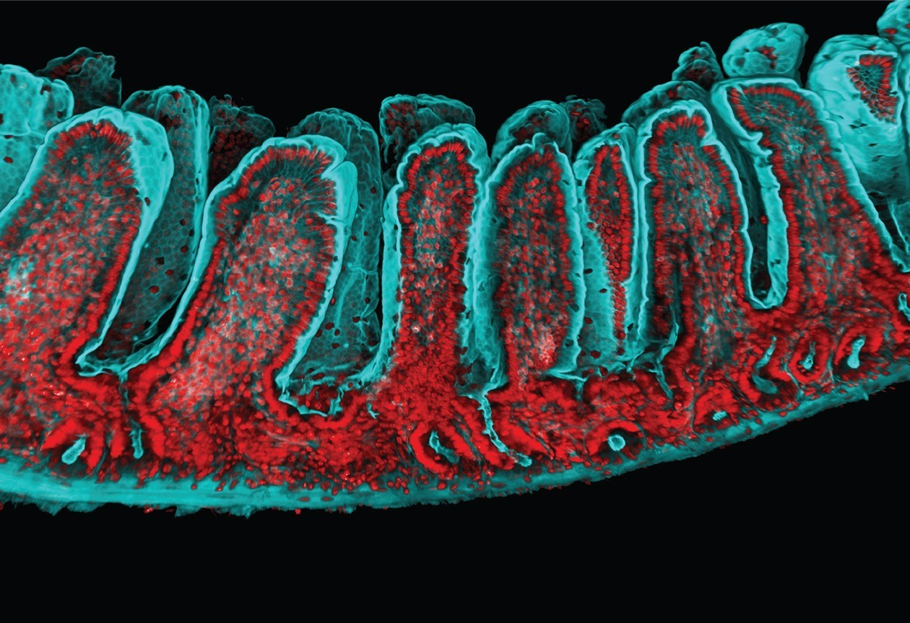
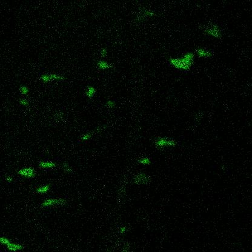
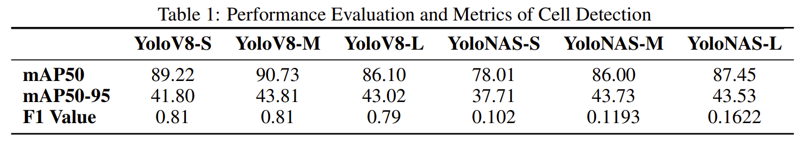
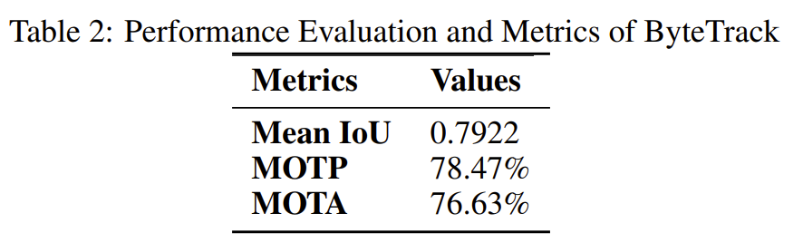
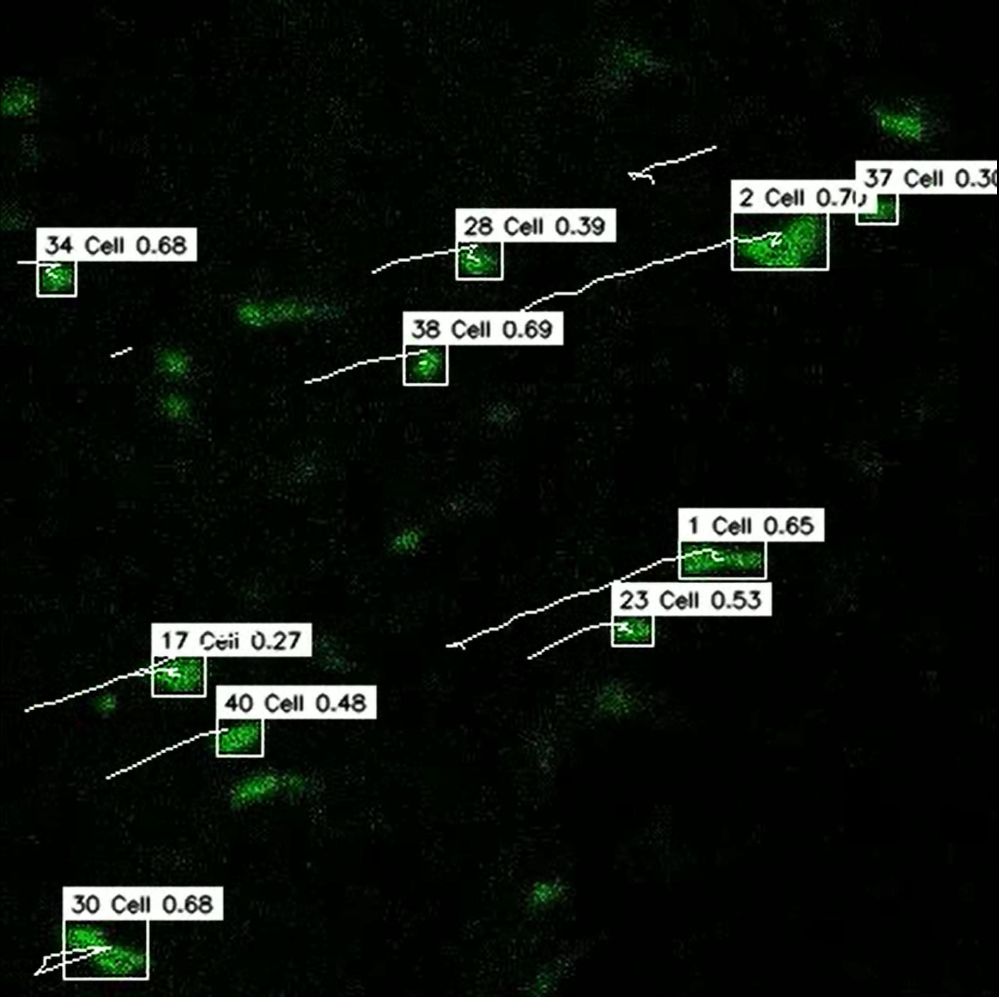

# Deep Learning based approaches for Investigating Signaling Dynamics in Intestinal Stem Cells (ISCs)

Image Source: https://www.science.org/doi/10.1126/science.abb6848

## Overview
Studying homeostasis stem cells holds the potential to unlock an understanding of the intricate stem cell’s proliferation and differentiation. Deciphering the movements of fluorescent kinase translocation reporters (KTRs) in intestinal stem cells (ISCs) can provide valuable insights into the time-dependent and spatial dynamics within signalling pathways, particularly those determining cell fate within the extracellular signal-regulated kinase (ERK) node of the Ras/MAPK pathway. The bioimage analysis is a crucial aspect of investigations, and image segmentation serves as its foundation. Segmenting kinase translocation reporter’s (KTRs) microscopy images manually is time-consuming, and inimitable. Although FIJI’s automated ImageJ Macro scripts offer a computerised segmentation option, it still suffers from extended processing times and potential inaccuracies. This research presents a novel approach using deep learning algorithms to ensure reliable and accurate cell detection and tracking of intestinal stem cell (ISCs) trajectories in video frames captured at different time intervals. Subsequent testing models on testing datasets aimed to bolster model adaptability. The findings demonstrated that when trained on microscopic imaging datasets, object identification algorithms may not invariably detect and trace every cell in a frame. However, the mAP50 value of the YOLOv8 model reached an impressive 0.9073, accompanied by a Multiple Object Tracking Precision of 78.47%.These results emphasise the potential of using deep learning approaches for studying temporal kinase dynamics in ISCs and speeding the process for future research in stem cell homeostasis bioimage analysis. This is the first attempt to explore the development of deep learning models and tracking algorithms in this context, providing a foundation for future work in this field.

## Method

The study methodology used two state-of-the-art object detection models, namely YOLOv8 and YOLONAS, to address the task of automated identification of intestinal stem cells in microscopic pictures. In comparison to YOLOv8, the model presents a notable benefit in terms of computing efficiency and accuracy due to its compact dimensions. The architectural design incorporates a modified CSPDarknet53 backbone of YOLOv5, which consists of a total of 53 convolutional layers. Three separate iterations of YOLOv8, namely YOLOv8-S, YOLOv8-M, and YOLOv8-L, were selected and trained. The training process consisted of 50 epochs, during which a small batch size was used. In contrast, the YOLONAS models were trained and were restricted to a maximum of 20 epochs, since further training beyond this point did not result in noteworthy improvements. The ByteTrack object tracking algorithm utilises pre-trained weights from the YOLOv8-M models as underlying structures for the purpose of detecting intestinal stem cells in consecutive frames.

#### Ensemble System Structure Description

  

#### Dataset

  

Dataset in '.lif' format and it consists of 10 distinct series. Each series can be conceptualised as a video or sequence of images, with approximately 25 frames and dimensions of pixels 416 x 416. These frames display fluorescence images indicative of kinase activity in the gut and thus represent Intestinal Stem Cells (ISCs).

#### Notebook

Cell Detection Model YoloV8

Cell Detection Model YOLONAS

Cell Tracking ByteTrack Algorithm

## Results

For cells detection in microscopic images of intestinal stem cells, we
developed a comprehensive framework that leverages YOLO variants, including YOLOv8-S, YOLOv8-M, and YOLOv8-L, as well as YOLONAS-S, YOLONAS-M, and YOLONAS-L. Not only did the novel YOLOv8-M model architecture demonstrate superior detection capabilities with an impressive mAP50 score of 90.73 it also excelled in our evaluation.

  

For the Bytetrack algorithm to track each individual cell in a given frame, the best-performing model for object detection was employed. Tracking metrics and achieving a MOTP of 78.47% and a MOTA of 76.66%, respectively. 

  

  

Notably, the study demonstrated that, despite the high accuracy of cell detection, not every detected cell contributes to tracking inconsistencies, validating the robustness of our method in capturing the true trajectories of intestinal stem cells.
